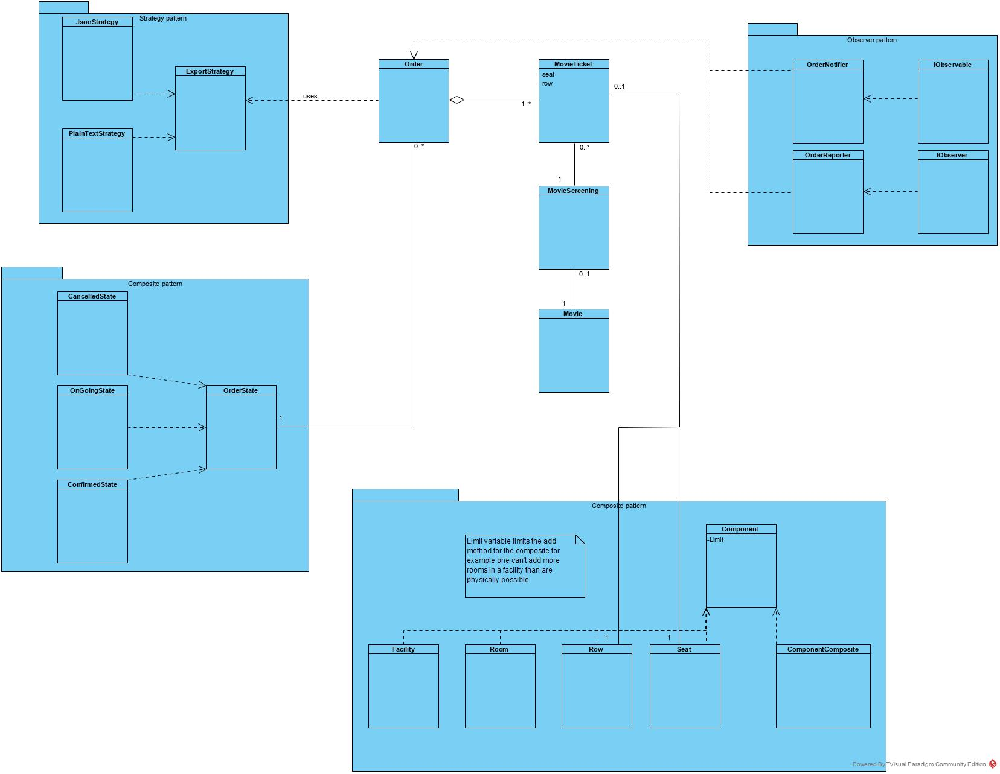

# 🎬 Cinema Ticket System – C# Design Patterns Showcase

This C# console application simulates a cinema ticketing system — but its true purpose is to serve as a playground for **intensive use of design patterns**. Created to demonstrate proficiency in software architecture and pattern implementation, this project intentionally applies a wide range of patterns far beyond typical necessity.

This project was intentionally **over-engineered** to explore and demonstrate mastery of object-oriented design principles and patterns. It is not intended for production use or realistic application.

> This project was developed as part of a school assignment for an **Solution Architecture** course.

---

## 🧱 Design Patterns Implemented

This system was built with the goal of practicing and integrating many classic design patterns. Some of the patterns used include:
- Singleton
- Composite
- Observer
- Strategy
- State
- Inheritance / Polymorphism (OOP principle)

